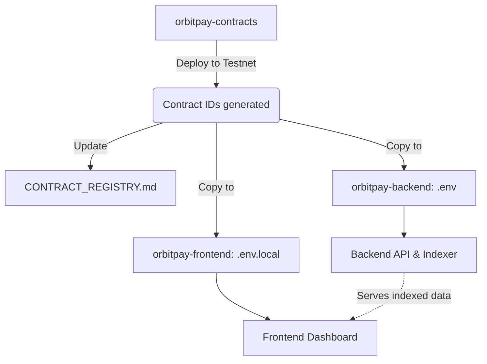

# OrbitPay Cross-Repo Local Development Guide

Welcome! This guide is for contributors who need to run the **entire OrbitPay polyrepo stack** (contracts, backend, frontend, SDK) locally on the Stellar Testnet. 

Because our architecture is distributed across multiple repositories, correctly passing configuration (specifically contract IDs) from the deployed smart contracts to the backend and frontend is critical.

> **Note**: For production or staging deployment instructions, please see [DEPLOYMENT.md](DEPLOYMENT.md). For a full breakdown of secrets and environment variables, see [CONFIGURATION.md](CONFIGURATION.md).

---

## The Big Picture: Configuration Flow

When you bring up the stack, you must follow a specific sequence. Contract deployment generates the IDs that every other service relies on.



---

## Step 1: Prerequisites & Wallet Setup

You'll need the Soroban CLI, Docker, Node.js, and Rust installed. 

First, configure your local Soroban CLI for the Stellar Testnet and generate a funded deployer identity:

```bash
# Add the testnet network configuration
soroban network add \
  --global testnet \
  --rpc-url https://soroban-testnet.stellar.org \
  --network-passphrase "Test SDF Network ; September 2015"

# Generate a new identity for deploying contracts
soroban keys generate --global deployer --network testnet

# Fund the identity using Friendbot
soroban keys fund deployer --network testnet
```

Keep your `deployer` public key handy; you will need it to authorize testnet transactions in the frontend. You should also import its secret key into your Freighter browser wallet for testing.

---

## Step 2: Deploy Contracts

Clone the `orbitpay-contracts` repository. You must build and deploy the contracts to testnet to get your unique Contract IDs.

```bash
git clone https://github.com/OBP-ORG/orbitpay-contracts.git
cd orbitpay-contracts

# Build the WASM artifacts
cargo build --release --target wasm32-unknown-unknown

# Deploy Treasury first (as others may depend on it)
soroban contract deploy \
  --wasm target/wasm32-unknown-unknown/release/treasury.wasm \
  --network testnet \
  --source deployer
```

Repeat the deployment for Payroll, Vesting, and Governance. 

**Important Action:** 
Copy the outputted Contract IDs (starting with `C...`) and update your local `CONTRACT_REGISTRY.md` to keep track of them.

---

## Step 3: Bootstrapping the Backend

Clone the `orbitpay-backend` repository. The backend requires a database and Redis, plus the contract IDs to know which events to index.

```bash
git clone https://github.com/OBP-ORG/orbitpay-backend.git
cd orbitpay-backend
```

1. **Environment Setup:** Copy the `.env.example` to `.env`.
   ```bash
   cp .env.example .env
   ```
2. **Inject Contract IDs:** Open `.env` and fill in the contract variables with the IDs you just generated:
   ```env
   TREASURY_CONTRACT_ID=C...
   PAYROLL_STREAM_CONTRACT_ID=C...
   VESTING_CONTRACT_ID=C...
   GOVERNANCE_CONTRACT_ID=C...
   ```
3. **Start Infrastructure:** Spin up PostgreSQL and Redis.
   ```bash
   docker compose up -d postgres redis
   ```
4. **Run Migrations:** Initialize the database schema.
   ```bash
   # Run Alembic migrations
   docker compose run --rm api alembic upgrade head
   ```
5. **Start Services:** Bring up the API and the Indexer.
   ```bash
   docker compose up -d api indexer
   ```
   
Verify the backend is healthy by visiting `http://localhost:8080/health`.

---

## Step 4: Bootstrapping the Frontend

Clone the `orbitpay-frontend` repository. The frontend needs to connect to both your local backend API and the Stellar testnet.

```bash
git clone https://github.com/OBP-ORG/orbitpay-frontend.git
cd orbitpay-frontend
```

1. **Environment Setup:** Create your local environment file.
   ```bash
   cp .env.example .env.local
   ```
2. **Inject Configuration:** Open `.env.local` and add the required network and contract details:
   ```env
   NEXT_PUBLIC_STELLAR_NETWORK=TESTNET
   NEXT_PUBLIC_API_BASE_URL=http://localhost:8080
   
   NEXT_PUBLIC_TREASURY_CONTRACT_ID=C...
   NEXT_PUBLIC_PAYROLL_STREAM_CONTRACT_ID=C...
   NEXT_PUBLIC_VESTING_CONTRACT_ID=C...
   NEXT_PUBLIC_GOVERNANCE_CONTRACT_ID=C...
   ```
3. **Install & Run:**
   ```bash
   npm install
   npm run dev
   ```

Open `http://localhost:3000` in your browser. Ensure your Freighter wallet is set to Testnet. 

---

## Step 5: End-to-End Verification

To verify the stack is functioning correctly:
1. Connect your Freighter wallet to the local frontend.
2. Create a test Payroll Stream on the dashboard.
3. Confirm the transaction succeeds on testnet using a block explorer.
4. Check the backend indexer logs (`docker compose logs -f indexer`) to ensure it picked up the `StreamCreated` event.
5. Refresh the frontend and confirm the stream appears in your UI, fetched from your local backend!

### Known Issues & Follow-ups
- *Note:* Friendbot funding occasionally rate-limits. If it fails, try funding via the [Stellar Laboratory](https://laboratory.stellar.org/).
- The script to automatically sync contract IDs across repositories is currently tracked in [TL-7]. For now, manual copy-pasting to `.env` files is required.
